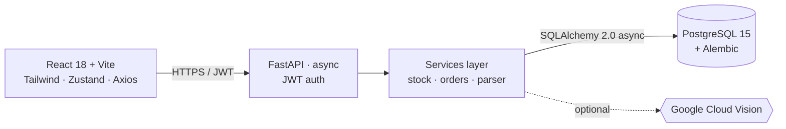

# KEEL · Inventory & Orders System

> Full-stack inventory management system that replaces Excel-based workflows for a
> real Argentine manufacturer. **Multi-client horizontal Excel parser**, OCR for
> handwritten orders, ACID-compliant stock movements with an immutable ledger,
> and a traffic-light dispatch preview that prevents accidental negative stock.


---

## The problem

KEEL S.A. is an Argentine plastics manufacturer (Mapuche® cleaning products line).
Until now, the entire supply chain ran on:

- A single Excel workbook with **6 different sheets** for stock per category
- Customer orders arriving as Excel files with **multiple clients in adjacent
  horizontal columns** (not rows — clients side by side, each block with its own
  `CLIENTE / TRANSPORTE / CODIGO / DETALLE / CANTIDAD` headers)
- Handwritten or photographed orders sent via WhatsApp
- **Zero validation** of stock availability before committing to dispatch
- Movements tracked by overwriting cells — no history, no audit trail

This system replaces all of that with a real database, a strict business-rule
engine, and a UI built for warehouse operators using their phone.

---

## Demo

> _Screenshots & demo GIF coming — drop the assets in `docs/screenshots/` and link
> them here._

```
docs/screenshots/
├── 01-dashboard.png       Stock summary + low-stock alerts
├── 02-stock-table.png     Catalog with alert badges
├── 03-order-upload.png    Drag & drop with OCR badge
├── 04-traffic-light.png   Preview table (green / amber / red rows)
└── 05-reversal-modal.png  Movement reversal with negative-stock guard
```

---

## Features

- **Multi-client Excel parser** — detects all `CLIENTE` markers in a sheet,
  parses each adjacent block independently. Works for the messy real-world
  format and for clean single-client files in the same pipeline.
- **OCR fallback** — JPG/PNG/PDF/TIFF/WebP uploads route through Google Cloud
  Vision; UI badges parsed orders so operators verify before confirming.
- **Immutable stock ledger** — every movement (in/out/dispatch/adjustment) is
  stored in `stock_movements`. Nothing is ever deleted. To undo, the system
  creates a `REVERSA` movement linked to the original, enforced by a partial
  unique index that prevents double reversals at the database level.
- **ACID dispatch confirmation** — orders go through `PENDIENTE` →
  `PREVISUALIZADO` → `CONFIRMADO`. Confirming a dispatch acquires
  `SELECT FOR UPDATE` locks on each affected `stock_current` row, re-validates
  against current state, and only then writes all `EGRESO_DESPACHO` movements in
  a single transaction.
- **Conscious negative stock** — backorders are allowed but require explicit
  `accept_negative: true` confirmation. The UI surfaces the affected SKUs and
  resulting balances before letting the operator commit.
- **Traffic-light preview** — green / amber / red rows based on remaining stock
  vs configured minimums. Inline-editable quantities trigger an instant
  re-calculation server-side.
- **Role-based access** — `OPERARIO` (warehouse) vs `GERENCIA` (management).
  Reversing movements and managing the product catalog require `GERENCIA`.
- **Full audit log** — every privileged action (dispatch confirm, reversal,
  stock adjustment) is captured in `audit_log` with user, IP, and JSON payload.

---

## Architecture



**Layering rules:**

- `routers/` — HTTP only (validate request, call service, return response).
  Zero business logic.
- `services/` — Pure business logic. No HTTP types, no FastAPI imports outside
  of `HTTPException`. Composable: `order_service.confirm_dispatch` calls
  `stock_service.register_movement` N times within a single transaction.
- `models/` — SQLAlchemy ORM. Mirrors the SQL schema 1:1.
- `schemas/` — Pydantic v2 request/response DTOs. Never leak ORM objects to the
  network.

---

## Tech stack

| Layer | Choice |
|-------|--------|
| Database | PostgreSQL 15 with native enums, `JSONB`, `INET`, generated columns |
| ORM | SQLAlchemy 2.0 (async) with Mapped types, partial unique indexes |
| Migrations | Alembic, async engine |
| Backend | FastAPI, Pydantic v2, JWT (python-jose), bcrypt |
| Parser | openpyxl + pandas for spreadsheets, Google Cloud Vision for images |
| Frontend | React 18, Vite, React Router 6, Tailwind 3, Axios, Zustand (persisted) |

---

## Quick start (Docker)

The fastest way to see it running:

```bash
git clone https://github.com/YOUR_USER/keel-inventario.git
cd keel-inventario
docker compose up --build
```

Then open:

- **App** — http://localhost:5173
- **API docs** — http://localhost:8000/docs

Default login: `admin@keel.com` / `keel2025`

The backend container automatically:
1. Waits for Postgres to be ready
2. Runs `alembic upgrade head`
3. Seeds the catalog (29 real KEEL products) + opening stock + admin user
4. Starts uvicorn

---

## Manual setup

<details>
<summary>Click to expand</summary>

### Prerequisites

- PostgreSQL 15+
- Python 3.11+
- Node.js 18+

### Database

```bash
createdb keel_inventario
```

### Backend

```bash
cd backend
python -m venv venv && source venv/bin/activate    # Windows: venv\Scripts\activate
pip install -r requirements.txt
cp .env.example .env                                # edit credentials
alembic upgrade head
python -m app.seeds.initial
uvicorn app.main:app --reload --port 8000
```

### Frontend

```bash
cd frontend
npm install
npm run dev
```

</details>

---

## Project structure

<details>
<summary>Click to expand</summary>

```
keel-inventario/
├── backend/
│   ├── app/
│   │   ├── main.py              # FastAPI factory, CORS, router mounting
│   │   ├── config.py            # Pydantic Settings from .env
│   │   ├── database.py          # Async engine + sessionmaker + Base
│   │   ├── models/              # SQLAlchemy ORM (6 modules + audit)
│   │   ├── schemas/             # Pydantic v2 DTOs
│   │   ├── routers/             # auth, products, stock, clients, orders, audit
│   │   ├── services/            # auth, stock (ACID), orders, file parser
│   │   ├── core/                # security (JWT, bcrypt), dependencies
│   │   └── seeds/initial.py     # Idempotent seed: admin + 29 products + stock
│   ├── alembic/                 # Async migrations
│   ├── Dockerfile
│   └── requirements.txt
├── frontend/
│   ├── src/
│   │   ├── api/                 # Axios client + per-domain modules
│   │   ├── store/               # Zustand: authStore (persisted), uiStore (toasts)
│   │   ├── components/
│   │   │   ├── layout/          # Sidebar, TopBar, Layout (Outlet)
│   │   │   └── ui/              # Badge, DataTable, FileDropzone, Modal, Notifications
│   │   ├── pages/               # Login, Dashboard, Stock, Orders
│   │   └── App.jsx              # BrowserRouter + protected routes
│   ├── Dockerfile               # Multi-stage build with nginx serving
│   └── nginx.conf               # Reverse-proxies /api to backend
└── docker-compose.yml
```

</details>

---

## Key technical decisions

These are the calls that signal the difference between a tutorial project and a
production-ready system.

### 1. Immutable ledger with compensating entries

Stock can never be "fixed" by editing or deleting a movement. To correct a
mistake, the system creates a `REVERSA` movement with `reversed_movement_id`
pointing to the original. Combined with the partial unique index:

```sql
CREATE UNIQUE INDEX idx_movements_no_double_reversal
  ON stock_movements(reversed_movement_id)
  WHERE reversed_movement_id IS NOT NULL;
```

This guarantees at the database level that a movement can only be reversed
once. The audit trail is complete and reconstructible at any point in time.

### 2. ACID with row-level locking

`stock_service.register_movement` opens with `SELECT ... FOR UPDATE` on the
`stock_current` row before applying the delta. Concurrent movements on the same
SKU serialize correctly. The service flushes but does **not** commit — the
caller (router or `order_service`) controls transaction boundaries, so an order
with N items dispatches as a single atomic transaction.

### 3. Preview / confirm split for orders

Orders move through an explicit state machine:

```
PENDIENTE → PREVISUALIZADO → CONFIRMADO → DESPACHADO
```

The `PREVISUALIZADO` state stores a snapshot of stock availability per item
(`quantity_boxes_available`, `_shortage`, `_after_dispatch`) but does **not**
modify `stock_current`. This lets the operator edit quantities, the system
recalculate, and only commit movements at the explicit confirm step — at which
point stock is re-checked under lock to catch any race.

### 4. Conscious negative stock

Real warehouses sometimes need to dispatch before receiving. The schema allows
negative `quantity_boxes` (no `CHECK >= 0`). The flow:

1. Confirm dispatch → backend returns `409 DISPATCH_WOULD_GO_NEGATIVE` with the
   list of affected SKUs and resulting balances.
2. UI shows a modal listing each conflict.
3. Operator clicks "confirm anyway" → request retried with
   `accept_negative: true`.
4. Movement persists with `is_negative_dispatch: true` for later reconciliation.

### 5. Generated columns for derived state

`order_items.has_shortage` and `will_go_negative` are PostgreSQL `GENERATED ALWAYS AS ... STORED`
columns. The traffic-light logic never drifts out of sync with the underlying
quantities — they cannot be set independently.

### 6. Multi-client horizontal parser

The naïve approach (read with pandas, assume one client per file) fails on the
real KEEL format. The parser instead:

1. Scans every cell looking for `CLIENTE` markers
2. For each marker, scans 15 rows × 8 columns to find the header row
   (`CODIGO`, `DETALLE`, `CANTIDAD`, etc.)
3. Reads items until 2 consecutive empty rows or another `CLIENTE` marker
4. Returns a list of `ParsedOrder` — one per detected block

A single upload can create N orders. Rows with non-numeric quantities are
skipped silently (not failed) so a malformed cell doesn't abort the import.

### 7. Strategy pattern for parsers

The `OCRAdapter` abstract class isolates Google Cloud Vision behind an
interface. Swapping to AWS Textract or a local Tesseract instance requires
implementing one method. The Google Vision client uses lazy init so the
service starts even without credentials configured — only image uploads fail
(with a clear `503` message), spreadsheets work normally.

### 8. Authentication & authorization

- JWT in `Authorization: Bearer` header (not cookies — avoids CSRF for an SPA).
- Same 401 error message for "unknown user" and "wrong password" → prevents
  account enumeration.
- `is_active=false` accounts are rejected as 401 (not 403): a deactivated
  token simply stops being valid.
- Roles are pure capability gates: `require_gerencia` dependency vs
  `require_any_role`. No nested permission system because the requirements
  don't justify the complexity.

### 9. Database-first design

The Alembic migration is hand-written, not autogenerated. This gives precise
control over:

- Enum types (`CREATE TYPE` before `CREATE TABLE`)
- Partial unique indexes
- Generated columns
- Foreign key resolution order (`stock_movements.order_id` → `orders.id`
  exists because `orders` is created first)
- `gen_random_uuid()` as server-side default (no client-generated UUIDs)

---

## API reference

```
AUTH
  POST   /api/v1/auth/login                          → { access_token, user }
  GET    /api/v1/auth/me                             → UserResponse

PRODUCTS
  GET    /api/v1/products                            ProductResponse[]
  POST   /api/v1/products                            [GERENCIA]
  PUT    /api/v1/products/{id}                       [GERENCIA]
  DELETE /api/v1/products/{id}                       [GERENCIA]

STOCK
  GET    /api/v1/stock                               StockCurrentResponse[]
  GET    /api/v1/stock/alerts                        StockAlertResponse[]
  GET    /api/v1/stock/{product_id}/movements        MovementResponse[]
  POST   /api/v1/stock/movement                      MovementResponse
  POST   /api/v1/stock/movements/{id}/reverse        [GERENCIA]

CLIENTS
  GET    /api/v1/clients                             ClientResponse[]
  POST   /api/v1/clients
  PUT    /api/v1/clients/{id}

ORDERS
  GET    /api/v1/orders                              OrderResponse[]
  POST   /api/v1/orders/upload                       multipart, Excel/CSV/image
  GET    /api/v1/orders/{id}                         OrderDetailResponse
  PATCH  /api/v1/orders/{id}/items/{item_id}         edit quantity, re-validate
  POST   /api/v1/orders/{id}/confirm                 { accept_negative: bool }

AUDIT (GERENCIA only)
  GET    /api/v1/audit                               paginated, filter by entity_type
```

Interactive Swagger at `/docs` with all schemas, examples, and a built-in
"Try it out" button.

---

## Roadmap

- [ ] End-to-end tests with `pytest-asyncio` + httpx async client
- [ ] CI/CD via GitHub Actions (lint, type-check, test, build Docker images)
- [ ] Per-warehouse stock segregation (multi-tenant)
- [ ] PDF dispatch receipts with batch printing
- [ ] WhatsApp Business API integration for "send invoice" button
- [ ] Refresh tokens with rotation
- [ ] OpenTelemetry traces

---

## License

MIT — see [LICENSE](LICENSE).

---

## Author

Built as a practical demonstration of full-stack backend-heavy engineering:
async Python, relational schema design, business-rule modeling, and a
production-style React frontend.

For questions, feedback, or hiring inquiries, open an issue or reach out via
GitHub.
